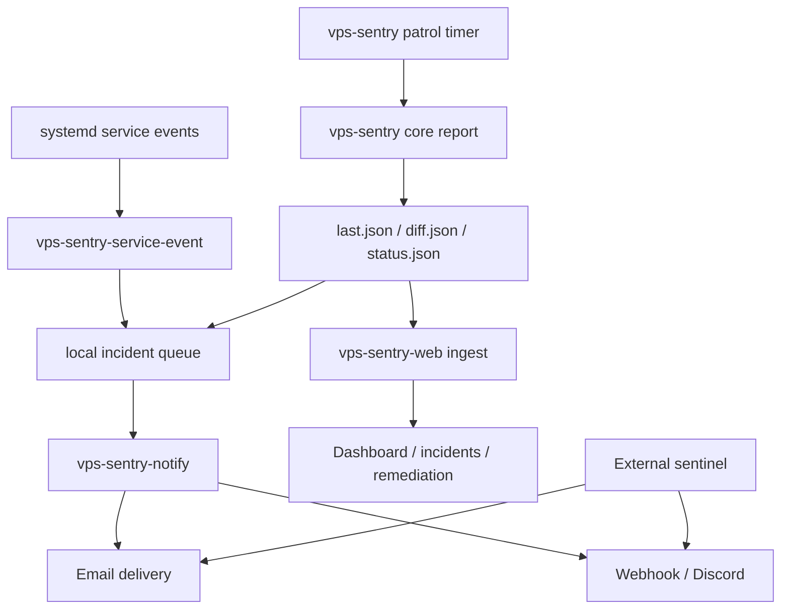

# VPS Sentry Upgrade Plan

This document turns the current roadmap into a concrete build plan.

It covers:

- how VPS Sentry should detect app, service, project, and full-host outages
- how alerts should reach you even when `vps-sentry-web` is down
- how to evolve the current mixed host/web/ops scripts into one coherent system
- the recommended implementation order

## Why This Exists

The March 7 outage exposed the core design gap:

- `nginx` was up
- `vps-sentry-web.service` was down
- the host agent saw the condition
- but the condition did not become a real alert with guaranteed delivery

The detector cannot depend on the thing that is down.

`vps-sentry-web` should remain the control plane, dashboard, and operator workflow.
It should not be the only path that can tell you it is dead.

## Layman View

Think of the finished system as four layers:

1. A patrol guard:
   The host agent keeps checking the VPS every few minutes.
2. A fire alarm:
   Critical services trigger an alert immediately when they stop or fail.
3. A dispatcher:
   Alerts are sent by a host-side notifier that can email you even if the dashboard is dead.
4. An outside witness:
   A second watcher outside the VPS checks whether the whole box, network, DNS, TLS, or nginx edge is gone.

That gives three useful guarantees:

- If one project breaks, you get a project-specific alert.
- If the VPS Sentry web app breaks, you still get notified.
- If the entire VPS disappears, something outside the VPS still notifies you.

## Target Outcomes

The upgraded system should meet these goals:

- Critical service stop or failure:
  Email within 60 seconds.
- Patrol-detected app health failure:
  Email within 5 minutes.
- Full VPS unreachable from outside:
  Email within 2 minutes.
- Recovery:
  Recovery email within 5 minutes of the service returning.
- Noise control:
  No repeated paging every 5 minutes for the same incident unless reminder thresholds are reached.
- Planned work:
  Maintenance windows suppress paging during expected deploy/restart windows.

## Current State

Today the system already has useful pieces:

- Host patrol:
  `vps-sentry.service`
- Host shipping:
  `vps-sentry-ship.service`
- Host publish path:
  `/var/lib/vps-sentry/public/status.json`
- Web control plane:
  `vps-sentry-web`
- Ops checks:
  `vps-monitor.sh`, `vps-alert.sh`, SLO and backup scripts
- Observability and incidents:
  `vps-sentry-web` API and dashboard surfaces

The current weakness is that these pieces are only loosely connected.

## Main Design Principles

1. Detection must happen at the lowest reliable layer.
2. Delivery must not depend on the failed component.
3. Alerts must be durable, deduplicated, and recoverable.
4. Planned maintenance must be explicit and suppressible.
5. Every alert should carry enough context to start recovery immediately.
6. The web control plane should enrich alerts, not be required for first delivery.

## Target Architecture



## Capability Model

### 1) Host Patrol Layer

Responsibilities:

- collect runtime state
- detect drift and threat signals
- write canonical host state to `last.json`
- raise patrol-discovered alerts

Keep:

- `vps-sentry.service`
- `vps-sentry-publish`
- `vps-sentry-ports-normalize`

Upgrade:

- treat critical app/service checks as real alerts, not only warnings
- add service-state summaries into `status.json`
- include recovery detection and outage duration metadata

### 2) Immediate Service Event Layer

Responsibilities:

- detect service stop/failure immediately
- create an alert without waiting for the next patrol run

Add:

- `/usr/local/bin/vps-sentry-service-event`
- `/etc/systemd/system/vps-sentry-unit-event@.service`
- service drop-ins for critical units

Recommended wiring for critical units:

- `OnFailure=vps-sentry-unit-event@%n.service`
- `ExecStopPost=/usr/local/bin/vps-sentry-service-event --unit %n --state stopped`

Critical units for first rollout:

- `vps-sentry-web.service`
- `vps-sentry-ops-worker.service`
- `nginx.service`
- `ssh.service` or `sshd.service`

Second-wave units:

- project web/API services
- chain/indexer/faucet units
- backup or sync jobs whose failure should page

### 3) Host Notification Dispatcher

Responsibilities:

- send email and webhook notifications directly from the VPS
- queue failed deliveries
- deduplicate repeated incidents
- send recovery messages

Add:

- `/usr/local/bin/vps-sentry-notify`
- `/var/lib/vps-sentry/notify/queue/`
- `/var/lib/vps-sentry/notify/sent/`
- `/var/lib/vps-sentry/notify/failed/`
- `/var/lib/vps-sentry/incidents/`

Delivery channels:

- email
- webhook
- optional Discord

Do not depend on:

- `vps-sentry-web`
- Next.js routes
- browser sessions

### 4) External Sentinel Layer

Responsibilities:

- detect full-host, network, DNS, TLS, or nginx edge outages
- alert even when the VPS is completely unreachable

This must run off-box.

Recommended checks:

- `https://vps-sentry.tokentap.ca/`
- `https://vps-sentry.tokentap.ca/api/readyz`
- direct TCP reachability to `443`
- DNS resolution
- certificate expiry

Preferred execution locations:

- a second VPS
- GitHub Actions scheduled workflow
- a small external cron host

This layer is mandatory if "the watcher is down" includes "the whole VPS is dead."

### 5) Project Registry

Responsibilities:

- tell VPS Sentry what projects live on the box
- define what health means for each project
- map alerts to real project names instead of raw units and ports

Add:

- `/etc/vps-sentry/projects.json`

Recommended schema:

```json
{
  "projects": [
    {
      "id": "vps-sentry",
      "label": "VPS Sentry",
      "service": "vps-sentry-web.service",
      "domain": "vps-sentry.tokentap.ca",
      "health_urls": [
        "http://127.0.0.1:3035/",
        "http://127.0.0.1:3035/api/readyz"
      ],
      "severity": "critical",
      "expected_owner": "tony"
    }
  ]
}
```

First registry entries should include:

- VPS Sentry
- TokenTap
- TMail
- TokenChain web/indexer
- AoE2HDBets web/API
- Pulse web/API
- Redline Legal web/API
- Wallyverse web/API
- WheatAndStone app/API

### 6) Incident and Recovery Layer

Responsibilities:

- persist open incidents
- track first seen, last seen, acknowledged, resolved
- send reminder emails
- send recovery emails

Alert lifecycle:

- `open`
- `acknowledged`
- `resolved`

Fingerprint model:

- one fingerprint per host + project + service + failure type

Example:

- `service_inactive:157.180.114.124:vps-sentry:vps-sentry-web.service`

Reminder schedule:

- immediate
- 5 minutes
- 15 minutes
- 60 minutes
- daily until resolved

Recovery email should include:

- incident title
- resolved timestamp
- outage duration
- last known failing signal
- service and host identity

## Configuration Model

### On-Host Config Files

Existing:

- `/etc/vps-sentry.json`

Add:

- `/etc/vps-sentry-notify.env`
- `/etc/vps-sentry/projects.json`
- `/run/vps-sentry/maintenance/*.ttl`

Recommended environment keys in `/etc/vps-sentry-notify.env`:

- `VPS_SENTRY_NOTIFY_EMAIL_PROVIDER`
- `VPS_SENTRY_NOTIFY_EMAIL_FROM`
- `VPS_SENTRY_NOTIFY_EMAIL_TO`
- `VPS_SENTRY_NOTIFY_WEBHOOK_URLS`
- `VPS_SENTRY_NOTIFY_ROUTE_INFO`
- `VPS_SENTRY_NOTIFY_ROUTE_WARN`
- `VPS_SENTRY_NOTIFY_ROUTE_CRITICAL`
- `VPS_SENTRY_NOTIFY_COOLDOWN_SECONDS`
- `VPS_SENTRY_NOTIFY_REMINDER_SCHEDULE`
- `VPS_SENTRY_NOTIFY_EXTERNAL_SENTINEL_NAME`

Important:

- recipient addresses should live on-host, not in the repo
- the same goes for SMTP/API credentials

## Alert Envelope

All detection paths should converge on one payload shape:

```json
{
  "fingerprint": "service_inactive:157.180.114.124:vps-sentry:vps-sentry-web.service",
  "state": "open",
  "severity": "critical",
  "source": "systemd-hook",
  "host": "157.180.114.124",
  "project": "vps-sentry",
  "service": "vps-sentry-web.service",
  "title": "VPS Sentry web service inactive",
  "detail": "The service is not active and nginx upstream requests will fail.",
  "first_seen_ts": "2026-03-07T19:20:10Z",
  "last_seen_ts": "2026-03-07T19:20:10Z",
  "evidence": {
    "systemctl_status_path": "/var/lib/vps-sentry/incidents/.../status.txt",
    "journal_path": "/var/lib/vps-sentry/incidents/.../journal.txt"
  }
}
```

## Email Delivery Strategy

For service-down alerts, email should come from the host-side notifier first.

Recommended provider order:

1. transactional API provider
2. authenticated SMTP provider
3. local `sendmail` fallback only if explicitly wanted

Email classes:

- incident open
- reminder
- recovery
- delivery failure to secondary channels

Subject examples:

- `[VPS Sentry] CRITICAL: VPS Sentry web service inactive`
- `[VPS Sentry] RECOVERY: VPS Sentry web service restored`

## Maintenance Windows

Planned deploys and restarts need suppression.

Add:

- `/usr/local/bin/vps-sentry-maintenance`

Modes:

- `start --scope vps-sentry-web.service --ttl 10m --reason deploy`
- `stop --scope vps-sentry-web.service`
- `status`

Behavior:

- stop/failure hooks still record events
- paging is suppressed while a valid maintenance token exists
- if the service does not recover before the token expires, page immediately

## Evidence Capture

For `critical` incidents, capture at minimum:

- `systemctl status <unit>`
- `journalctl -u <unit> -n 120`
- relevant nginx error snippets
- local port probe result
- recent deploy ref and commit
- process table snippet

Store under:

- `/var/lib/vps-sentry/incidents/<fingerprint>/<ts>/`

## Implementation Phases

### Phase 1: Make Service-Down Alerts Real

Goal:

- `vps-sentry-web.service` downtime produces a real host alert and sends email

Scope:

- keep current host agent
- add host email notification path
- add immediate service stop/failure hook

Deliverables:

- ship the existing `app_service_inactive` patrol alert path
- add `vps-sentry-notify`
- add `vps-sentry-service-event`
- add `vps-sentry-unit-event@.service`
- add service drop-in for `vps-sentry-web.service`
- add recovery email path
- add maintenance suppression
- add self-test coverage

Acceptance criteria:

- unexpected stop of `vps-sentry-web.service` sends email without waiting for the web app
- reminder emails dedupe correctly
- recovery email arrives after restart
- planned restart under maintenance does not page

### Phase 2: Unify Alert Routing

Goal:

- remove the split between host ship alerts and ad-hoc ops scripts

Scope:

- make `vps-alert.sh` and host shipping share one routing model
- standardize severity, cooldown, and recipients

Deliverables:

- one alert envelope
- one delivery policy
- shared recipient and route config
- observability for host-side notify delivery

### Phase 3: Make It Project-Aware

Goal:

- know which app broke, not just which process died

Scope:

- add project registry
- add project health probes
- enrich alerts with project/domain/unit ownership

Deliverables:

- `/etc/vps-sentry/projects.json`
- project-specific probes and outage messages
- dashboard grouping by project

### Phase 4: Add External Sentinel

Goal:

- detect total-host or edge outages

Scope:

- build or configure off-box monitoring
- send alerts through the same email policy

Deliverables:

- scheduled external checks
- DNS/TLS/HTTP reachability probes
- separate incident source labeled `external-sentinel`

### Phase 5: Incident Engine and Recovery UX

Goal:

- make the control plane useful after the first page

Scope:

- incident records
- acknowledgements
- escalation timers
- recovery history

Deliverables:

- durable incident store
- open/ack/resolved views
- reminder controls
- outage duration summaries

### Phase 6: Fleet and Productization

Goal:

- scale the design beyond one VPS

Scope:

- host onboarding
- multi-host registry
- per-host policies
- central incident aggregation

Deliverables:

- generalized host enrollment
- fleet-wide incident view
- configurable host tiers and alert policies

## Recommended Immediate Build Order

If shipping this in the next few sessions, do it in this order:

1. Implement `vps-sentry-notify` with email + webhook support.
2. Add local incident queue and dedupe fingerprints.
3. Add `vps-sentry-service-event` and hook `vps-sentry-web.service`.
4. Add maintenance token support.
5. Add recovery email generation.
6. Convert current ops scripts to reuse the same notifier.
7. Add external sentinel.

## Immediate Next Coding Slice

The next slice should be small and valuable:

- build `vps-sentry-notify`
- configure host-side recipient/env loading
- wire `vps-sentry-app-sanity` and `vps-sentry-service-event` into it
- verify open + reminder + recovery email flow for `vps-sentry-web.service`

That is the minimum slice that turns VPS Sentry from "can notice the dashboard is down" into "can actually page you when the dashboard is down."

## Open Decisions

These should be decided before or during Phase 1:

- Which email provider is preferred?
- Should webhook and email both fire for every critical alert?
- What should the reminder cadence be?
- Where should the external sentinel run?
- Which services are page-worthy immediately vs patrol-only?
- Which maintenance windows should be auto-created by deploy scripts?

## Definition of Done

The upgrade is successful when all of the following are true:

- stopping `vps-sentry-web.service` unexpectedly sends an email from the host
- restarting it sends a recovery email
- stopping it during planned maintenance does not page
- making the web app unhealthy while the process stays up also pages
- a total VPS outage is still caught by an off-box sentinel
- alerts name the affected project and service clearly
- the dashboard remains helpful, but no longer represents a single point of alerting failure
